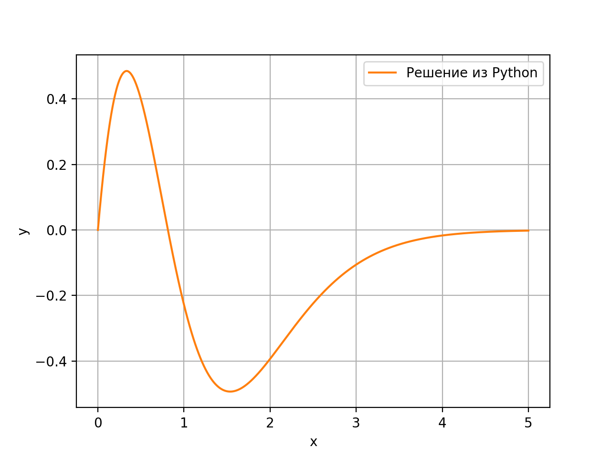
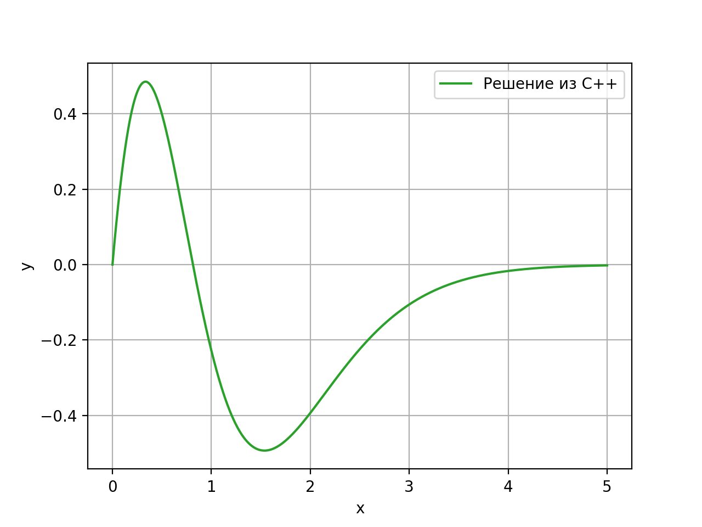
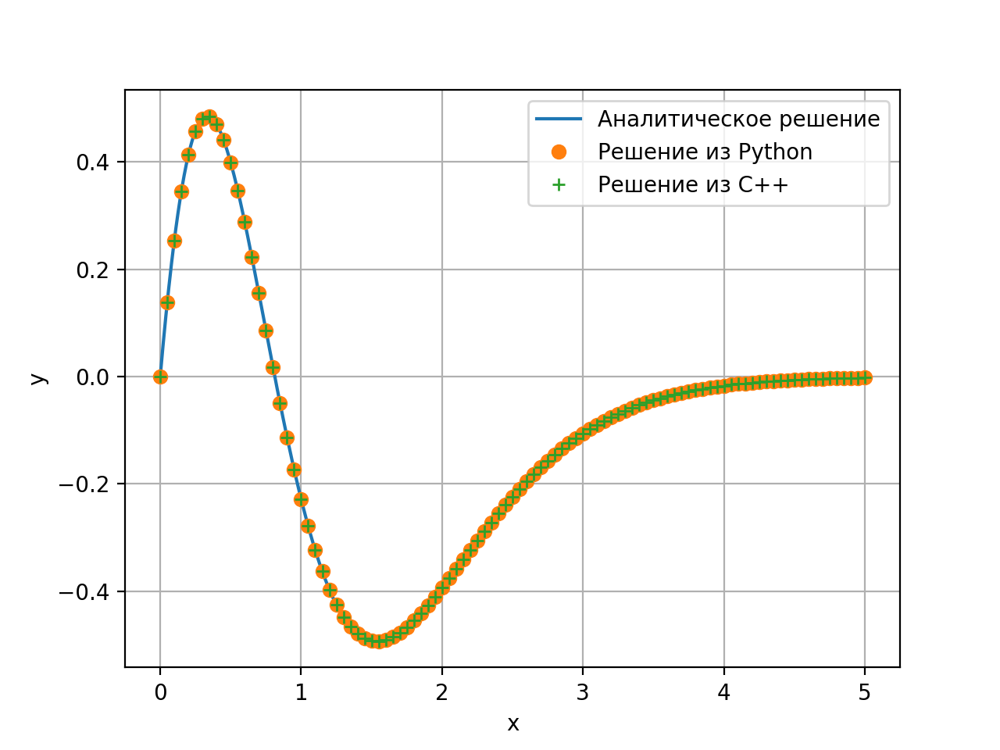

### Численное решение ОДУ
Контактные данные:
- Махмутов Галим Сагитович
- makhmutov.gs@gmail.com
- +7-926-402-57-54

# Задача Коши
$$
\frac{d^5y}{dx^5} + 15 \frac{d^4y}{dx^4} + 90 \frac{d^3y}{dx^3} + 270 \frac{d^2y}{dx^2} + 405 \frac{dy}{dx} + 243y = 0,\ x∈[0, 5]
$$
$$
y(0) = 0,\  \frac{dy}{dx}(0) = 3,\ \frac{d^2y}{dx^2}(0) = -9,\ \frac{d^3y}{dx^3}(0) = -8,\ \frac{d^4y}{dx^4}(0) = 0
$$

Для численного решения этой задачи сделаем обозначения:

$$
y_0 = y,\ y_1 = \frac{dy}{dx},\ y_2 = \frac{d^2y}{dx^2},\ y_3 = \frac{d^3y}{dx^3},\ y_4 = \frac{d^4y}{dx^4}
$$

Тогда уравнение перепишется в виде системы ОДУ первого порядка:

$$
\begin{cases}
y_0' = y_1 \\
y_1' = y_2 \\
y_2' = y_3 \\
y_3' = y_4 \\
y_4' = -(15y_4 + 90y_3 + 270y_2 + 405y_1 + 243y_0) \\
\end{cases} \
x∈[0, 5],\\

y_0(0) = 0,\ y_1(0) = 3,\ y_2(0) = -9,\ y_3(0) = -8,\ y_4(0) = 0
$$

В качестве численного метода воспользуемся методом Рунге-Кутты четвертого порядка. Расчет значения вектора $ {\textbf  {y}}_{n}=[y_0, y_1, y_2, y_3, y_4]^T $ на следующем узле $ x_{n+1} $ сетки с шагом $ h $ происходит следующим образом:

$$
 \textbf{y}_{n+1} = \textbf{y}_n + {h \over 6}(\textbf{k}_1 + 2\textbf{k}_2 + 2\textbf{k}_3 + \textbf{k}_4),
$$
где
$$
{\textbf  {k}}_{1}={\textbf  {f}}\left(x_{n},{\textbf  {y}}_{n}\right),\\

{\textbf  {k}}_{2}={\textbf  {f}}\left(x_{n}+{h \over 2},{\textbf  {y}}_{n}+{h \over 2}{\textbf  {k}}_{1}\right),\\

{\textbf  {k}}_{3}={\textbf  {f}}\left(x_{n}+{h \over 2},{\textbf  {y}}_{n}+{h \over 2}{\textbf  {k}}_{2}\right),\\

{\textbf  {k}}_{4}={\textbf  {f}}\left(x_{n}+h,{\textbf  {y}}_{n}+h\ {\textbf  {k}}_{3}\right).

$$

# Программное решение
Для решения данной задачи написаны программы на языках C++ и Python, реализующие метод Рунге-Кутты четвертого порядка. В языке C++ реализована функциональная заготовка класса *OdeSolver*, результаты расчета сохраняются в файл. На языке Python реализован решатель в простейшем процедурном виде. Скрипт на Python помимо численного решения задачи Коши отрисовывает графики (в том числе и для решения, полученного в C++).

В качестве шага интегрирования для реализации на С++ выбрано значение 0.001, на Python значение 0.005.

Графики решения представлены ниже:

Для оценки адекватности численного решения данную задачу Коши можно решить аналитически и сравнить аналитическое решение с численным. Аналитическое решение выглядит следующим образом (подход к аналитическому решению представлен в конце документа):

$$
y(x) = \frac{1}{12}x e^{(-3x)} (36+54x - 16x^2 - 129x^3)
$$

Построим график этой функции и нанесем на него выборку точек из численных решений:

По данному графику можно сделать вывод об адекватности численного решения.

# Аналитическое решение
Для аналитического решения линейного дифференциального уравнения с постоянными коэффициентами
$$
\frac{d^5y}{dx^5} + 15 \frac{d^4y}{dx^4} + 90 \frac{d^3y}{dx^3} + 270 \frac{d^2y}{dx^2} + 405 \frac{dy}{dx} + 243y = 0,\ x∈[0, 5]
$$

составим соответствующее характеристическое уравнение:

$$
λ^5+15λ^4+90λ^3+270λ^2+405λ+243=0
$$

Можно заметить, что $ 243=3^5 $ и остальные коэффициенты уравнения соответствуют биному Ньютона, т.е. характеристическое уравнение представляется в виде:

$$
(λ+3)^5 = 0
$$

Корень $ λ = -3 $ кратности 5 соответствует общему решению вида:

$$
y = (C_1 + C_2x + C_3x^2 + C_4x^3+C_5x^4)e^{-3x},
$$

где $ C_1, C_2, C_3, C_4, C_5 $ — постоянные коэффициенты. Для их нахождения сначала необходимо сначала вычислить производные $ \frac{dy}{dx}, \frac{d^2y}{dx^2}, \frac{d^3y}{dx^3}, \frac{d^4y}{dx^4} $ для этого общения решения и затем вычислить значение коэффициентов из полученной системы с учетом начальных условий. Опуская выкладки с большим количеством операций, приведем значения этих коэффициентов:

$$
\begin{cases}
C_1=0\\
C_2=3\\
C_3=\frac{27}{6}\\
C_4=\frac{4}{3}\\
C_5=\frac{129}{12}
\end{cases}
$$

Соответственно, решение задачи Коши, представимо в аналитическом виде:

$$
y(x) = \frac{1}{12}x e^{(-3x)} (36+54x - 16x^2 - 129x^3)
$$